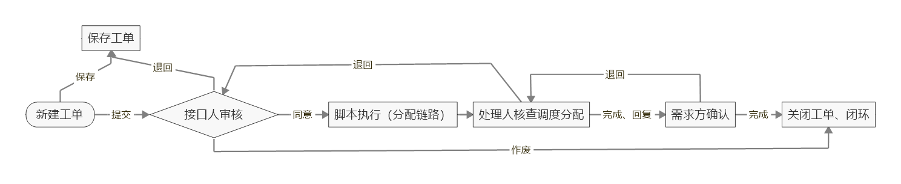

# 园区传输资源管理及调度系统
## 安装

### 安装依赖项

相关依赖项如 requirements.txt 文件所示，可通过指令快速安装：

```
(venv) $ pip install -r requirements.txt
```

### 数据库配置

- 安装 Mysql 数据库并创建项目所需数据库。

```
$ mysql -uroot -p
输入密码后命令如下
mysql> create database yuanqu default charset=utf8;
mysql> flush privileges;
```

- 安装 Redis

可参考：http://www.cnblogs.com/guanfuchang/p/6561126.html

- 修改 /yuanqu2/settings.py 数据库配置，根据本机配置按需修改。

```
DATABASES = {
    'default': {
        'ENGINE': 'django.db.backends.mysql',
        'NAME': 'yuanqu',  # 部署到服务器数据库名称要改
        'USER': 'root',  # 部署到服务器用户名要改
        'PASSWORD': '123456',  # 部署到服务器密码要改
        'HOST': 'localhost',  # 部署到服务器要改为127.0.0.1
        'PORT': '3306',
    }
}
```

- 迁移数据库

~~~
$ python manage.py makemigrations
$ python manage.py migrate
~~~

### 创建管理员账号、收集静态文件

```
$ python manage.py createsuperuser
$ python manage.py collectstatic
```

### 启动开发环境

```
$ python manage.py runserver
```

### 启动 Celery 任务

```
$ celery -A yuanqu2 worker -l info -P eventlet -Q celery,yqpass
```

### 新建工作流

如下图所示，可以使用脚本快速构建该工作流：



```
$ python generate_workflow.py
```

默认信息如下：

```
账号：shenqingren(需求方)、jiekouren(接口人)、chuliren(处理人)
密码：!QAZ2wsx
```

工单涉及字段信息：

```
{
    "workflow_id": 工作流id,
    "transition_id": 工单流转id,
    "sn": 工单编号
    "title": 工单标题, 
    "application_date": 工单申请日期（eg: 2018-08-08）,
    "open_date": 预计开通日期（默认 application_date 加10天）, 
    "person1": 移动方工程项目现场施工负责人, 
    "phone1": person1 电话,
    "email1": person1 邮箱, 
    "person2": 现场监理/配合人员, 
    "phone2": person2 电话,
    "email2": person2 邮箱, 
    "application_detail": 链路明细信息,
    "creator": 工单创建人,
    "modifier": 工单最后修改人,
    "gmt_created": 工单创建时间,
    "gmt_modified": 工单最后修改时间,
}
```


## 文档

该项目相关文档见目录 /docs 所示。

