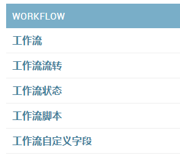
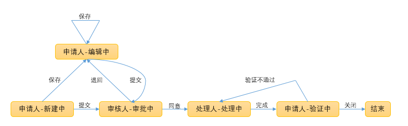
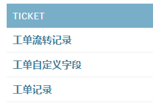
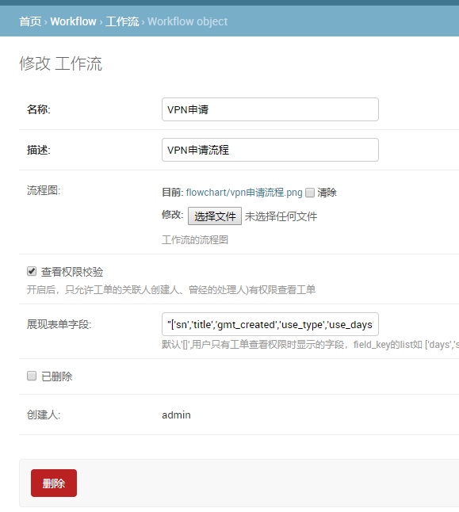
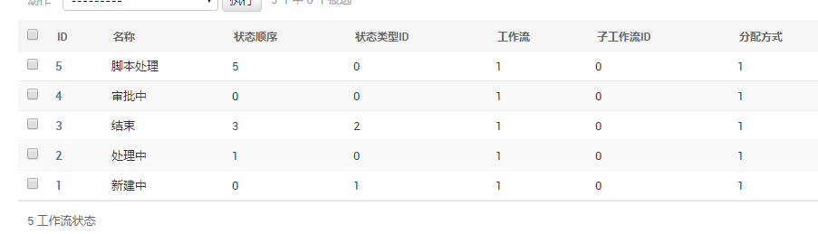
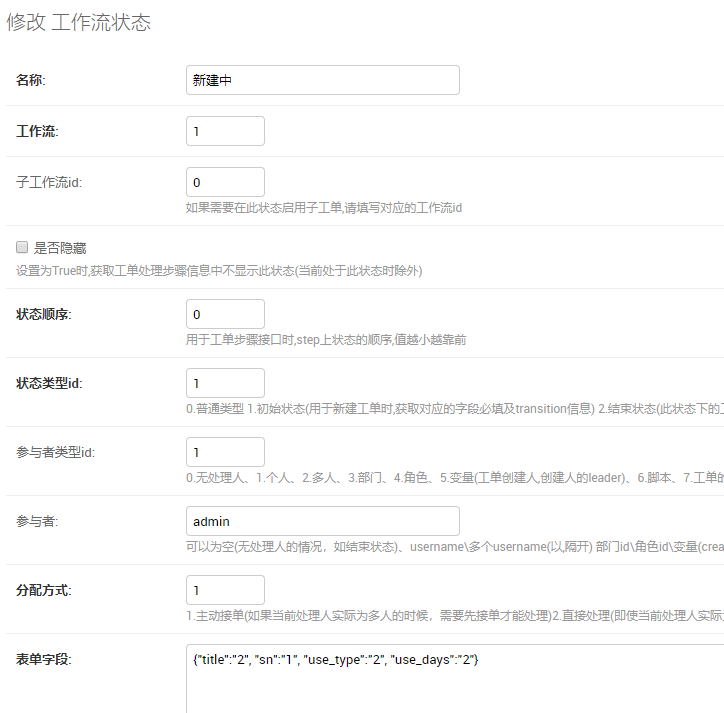
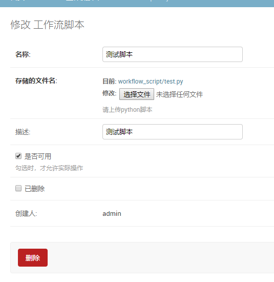
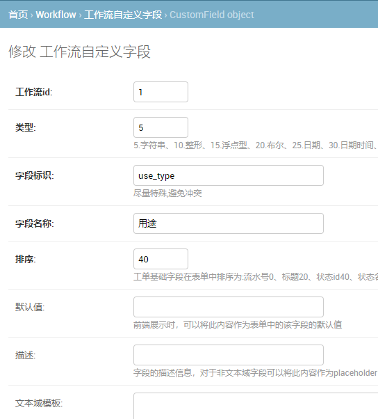
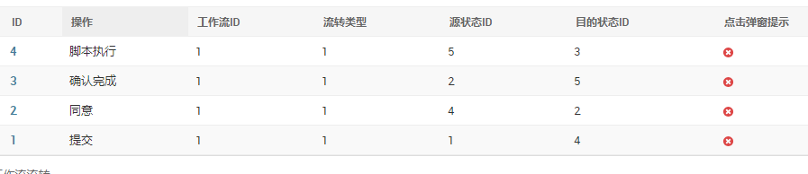

# 使用文档

这个系统目前由三大模块组成：

### 用户管理模块

拓展自官方 Auth 模块，根据用户部门、角色、管理员等三个方面来区分各自的权限。一个用户包含用户名、邮箱、手机、部门编号、角色编号、管理员权限等字段。

### 工作流模块

工单系统的流转只有由两大部分：工作流和工单组成，其中工作流模块分解下 models，可以看到有以下五个内容：

- 在工作流表新建各类工作流流程，例如：”申请链路流程“、”申请VPN流程“、”请假流程“；
- 在工作流状态表中，为每个工作流流程绑定各个可能存在的状态，比如“保存”、“审批中”、“处理中”等状态，在每一个状态中规定了此状态的处理人类型与处理人，还有涉及到的自定义字段；
- 在工作流流转表中，把每个工作流流程涉及到的各个状态串联起来，记录了每个状态的跳转信息，比如“审批通过”就是状态（审核中-处理中）的流转过程；
- 在工作流脚本表中，保存了各类自动化执行的脚本。工作流状态可以生成一个脚本处理的状态，工单流转到脚本处理状态，经脚本调用完成后再跳转到下一个状态。
- 最后在自定义字段中，定义了工作流流程中的自定义字段信息，比如我一个申请VPN的流程，那么就需要“申请理由”、“申请时常”等非常规字段。在这里生成各类需要的字段，最后在状态表中规定这些字段的使用权限。

这样子就定义了工单的审批链，各状态对应的处理人、可执行的操作，每个状态可显示的字段，可编辑的字段等信息。其中大致的流程图如下：

其他相关操作：

转交：在正常情况下工单会根据对应工作流设定的规则来流转。但假如出现这种情况：A提交了工单，B接单进行处理后发现自己处理不了，需要C才能进行处理。这时候就将工单转交给C，而工单所处的状态不变。

加签：加签与转交不同之处在于，比如上述例子B在处理过程中需要C做些操作或者提供些信息后才能处理，或者是审批人审批时想要给领导看看先。这时候将工单加签给C，C处理完后会回到B身上继续处理。

### 工单模块

具体的工单记录，用户新建的工单，将按照绑定的工作流的设计来实现此工单在不同状态下不同处理人之间的流转。

- 在工单记录表中，记录了该工单绑定的工作流，流水号、标题等基础字段，工单状态信息以及对应的处理人与类型等字段。
- 在工单自定义字段表中，根据相应工作流的自定义字段配置，保存的是自定义字段具体的值。比如工作流自定义字段规定了"请假天数"这个字段，是string类型的，那么工单自定义字段是保存了这个字段具体的值，比如5天。
- 至于工单流转记录表，其中记录了每张工单的处理记录信息，包括处理人信息，处理意见等字段。

### 配置工作流

- 登陆系统后台，首先新建一个工作流，填写需要信息，其中展现表单字段规定的是，没有处理权限但有查看权限的用户看到的工单字段。：

- 配置流程涉及的各个状态，其中每个状态要指定绑定的工作流ID，该状态的类型。以及在此状态下字段的读写权限等信息（'workflow_id', 'suggestion', 'username'这三个字段不用指定）。

- 配置工作流脚本，如果在某个状态下是要执行脚本的，请先在工作流脚本表中新建脚本信息。

- 配置自定义字段信息，根据状态需要先配置自定义字段类型。

- 设置流转信息，如下图所示，指定流转类型，源状态ID与目的状态ID，最后形成一个闭环。

